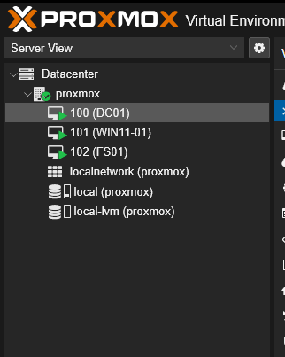
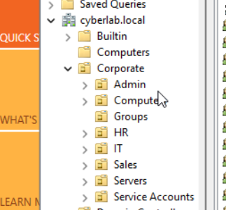
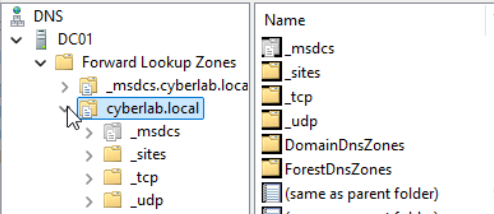
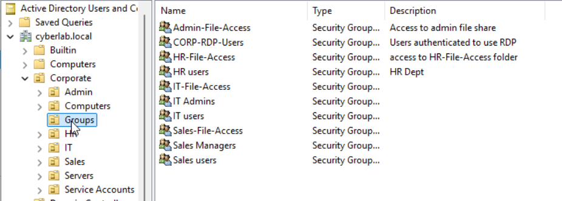
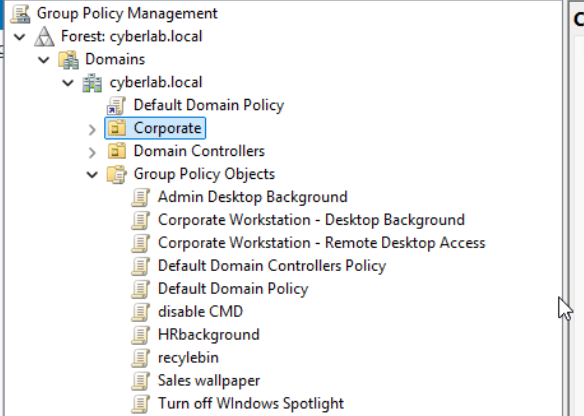
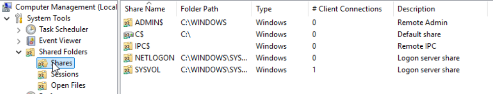
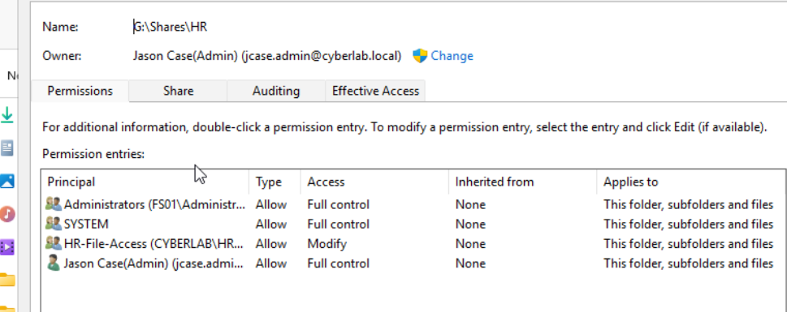
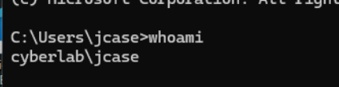

# Active Directory Security Lab

## Overview

This repository documents the design, deployment, administration, and security testing of an enterprise-style Active Directory lab.

The environment was built to develop practical experience with:

- Active Directory Domain Services
- Active Directory-integrated DNS
- Kerberos authentication
- Windows access tokens
- Security groups and authorization
- Group Policy
- NTFS and share permissions
- Remote Desktop access control
- Domain trust troubleshooting
- Attack simulation and detection engineering

The lab is hosted on an isolated Proxmox server and segmented from the production home network using pfSense firewall rules.

## Current Environment

| System | Role | IP Address |
|---|---|---|
| DC01 | Domain Controller, DNS Server | 192.168.60.11 |
| WIN11-01 | Domain-joined Windows 11 workstation | 192.168.60.21 |
| FS01 | Domain-joined Windows file server | 192.168.60.12 |

**Domain:** `cyberlab.local`
## Lab Screenshots

### Proxmox Lab

### Active Directory Organizational Units

### Active Directory DNS

### Security Groups

### Group Policy Management

### File Shares

### NTFS Permissions

### Domain Authentication

## Implemented Components

The following components are currently deployed and operational:

- Active Directory Domain Services and AD-integrated DNS on DC01
- Domain-joined Windows 11 workstation and Windows file server
- Organizational Units for users, computers, servers, groups, and service accounts
- Security groups used for file access and Remote Desktop authorization
- Group Policy used to manage domain systems and local group membership
- Departmental file shares protected with share and NTFS permissions
- Isolated lab network protected by pfSense firewall segmentation
- Troubleshooting and repair of domain trust and authentication issues

  ## Planned Security Testing

The lab will be expanded beyond administration and access control into controlled attack simulation and detection validation.

Planned scenarios include:

- Password spraying
- Kerberoasting
- Suspicious PowerShell activity
- Unauthorized privileged-group changes
- Credential and authentication abuse
- Windows event-log analysis
- MITRE ATT&CK mapping
- Detection queries and triage procedures

## Lab Goals

The purpose of this lab is to move beyond basic installation and understand how Windows enterprise security works internally.

The project focuses on the relationship between user authentication, Kerberos tickets, LSASS access token creation, security group SIDs, ACL evaluation, and the final access-control decision.
