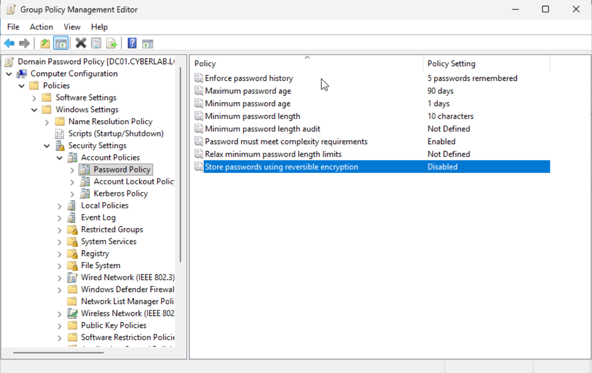
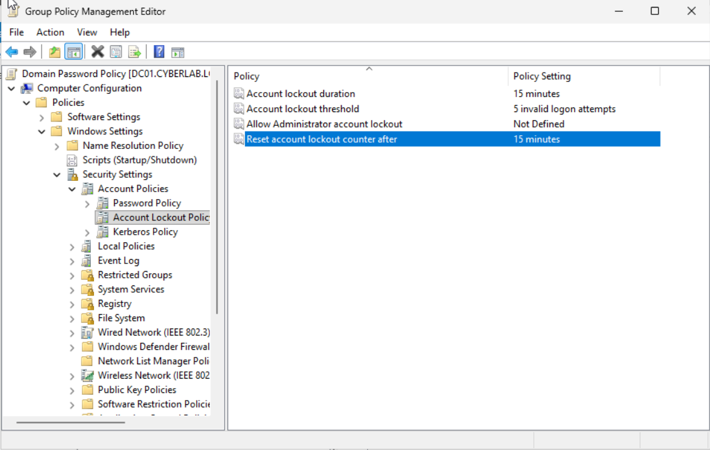
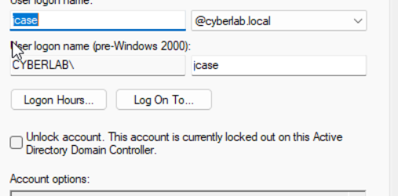
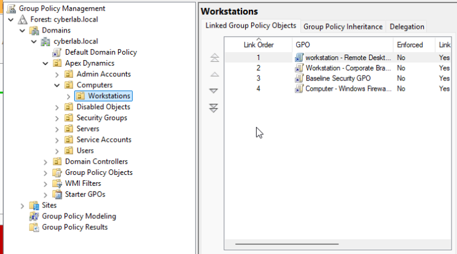
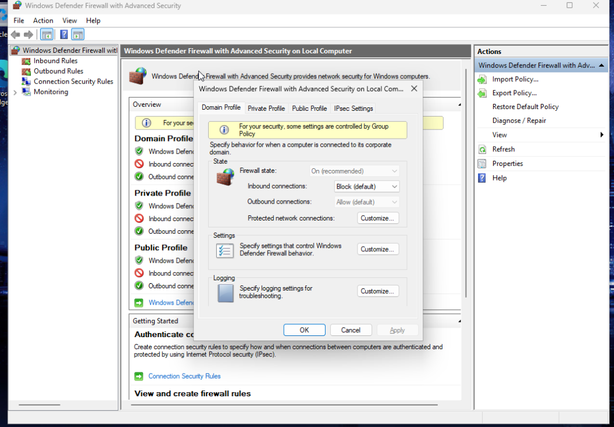
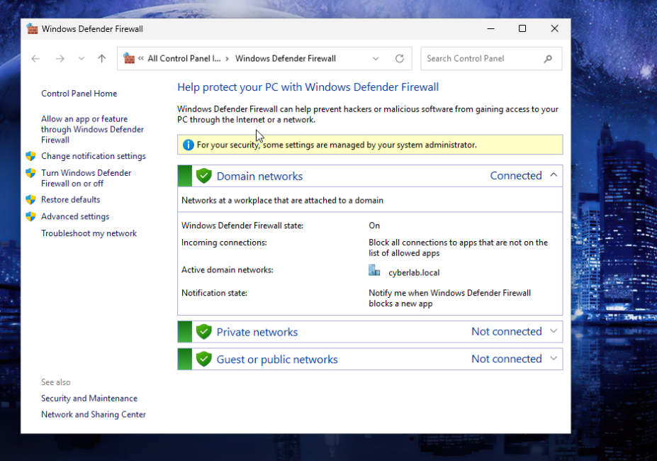

# Group Policy and Windows Security

This section documents the implementation and validation of Windows security controls within the 'cyberlab.local' Active Directory environment.

The goal was to move beyond basic domain configuration and apply centralized security policies that affect authentication, account protection, and host firewall behavior.

## Objectives

- Configure domain password requirements through Group Policy
- Implement account lockout protections
- Validate account lockout behavior from a domain workstation
- Identify and investigate account lockout events
- Configure Windows Defender Firewall through Group Policy
- Understand the difference between network firewall rules and host-based firewall rules
- Verify policy application and endpoint behavior

---
## Password Policy
A domain password policy was configured through Group Policy to enforce centralized password requirements for domain users.

### Evidence

This demonstrates centralized management of authentication requirements through Active Directory Group Policy rather than configuring individual endpoints manually.

## Account Lockout Policy

An account lockout policy was configured to temporarily lock domain accounts after repeated failed authentication attempts.

### Evidence

The policy was tested by intentionally generating failed authentication attempts from a domain-joined workstation.

The locked account was then confirmed within Active Directory .

## Windows Defender Firewall via Group Policy

Windows Defender Firewall settings were centrally configured through Group Policy.

During testing, communication between domain workstations initially failed even though routing between the systems was available.
The issue was traced to the Windows host firewall rather than the network firewall.
An inbound ICMP Echo rule was enabled to permit ping traffic.

The active Domain firewall profile was verified on the endpoint.

This reinforced the distinction between:
- Network firewall policy controlling traffic between networks.
- Windows Defender Firewall controlling traffic entering or leaving an individual endpoint.

---

## Validation

After the account was unlocked and the policies were validated, successful authentication was confirmed.

---
## Skills Demonstrated
- Active Directory Group Policy
- Domain password policy configuration
- Account lockout policy
- Windows authentication troubleshooting
- Windows Security Event Log analysis
- Event ID 4740 investigation
- Windows Defender Firewall
- Host-based vs. network firewall troubleshooting
- Policy validation and endpoint testing.
