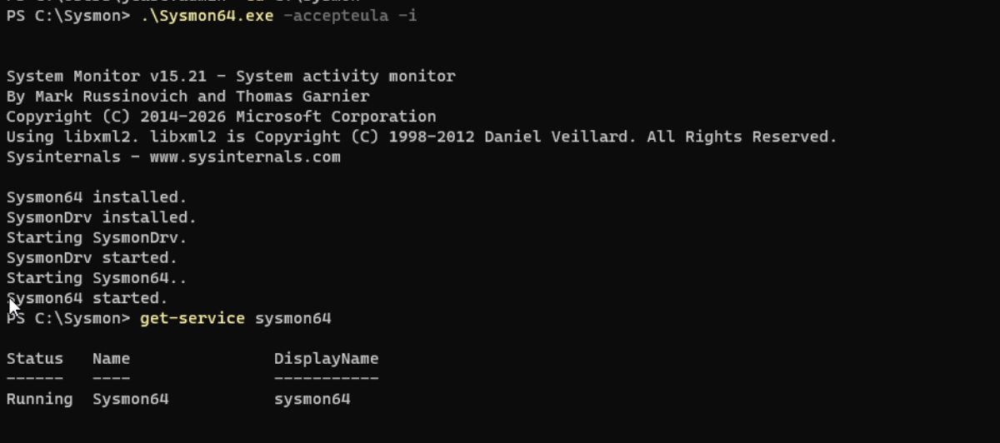
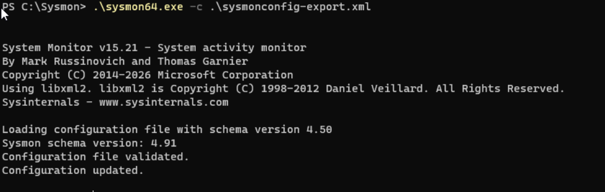
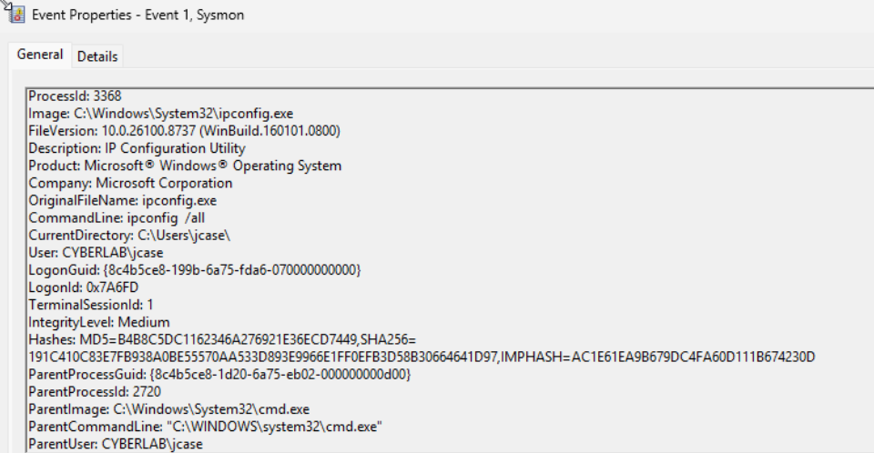
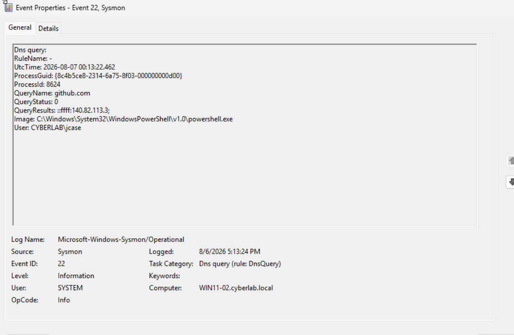
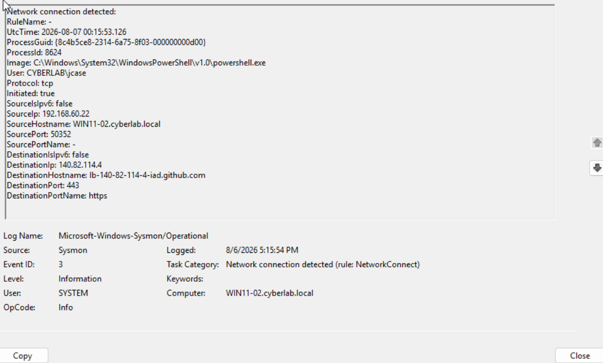
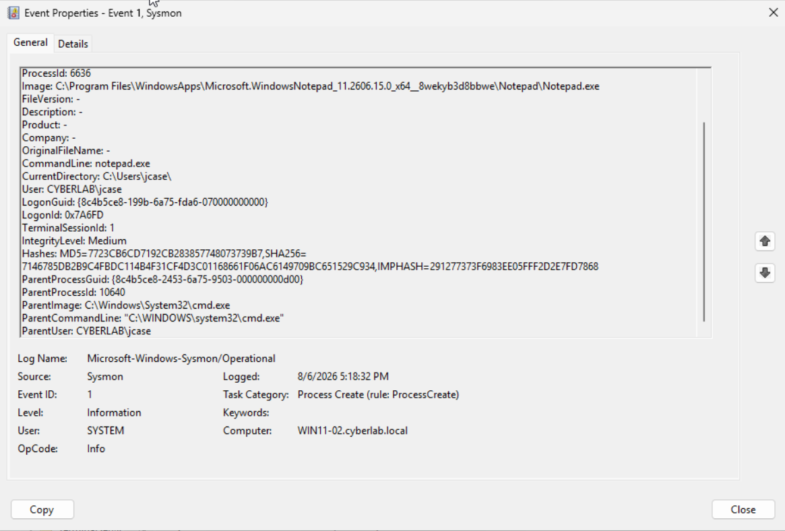

# Sysmon Telemetry

This section documents the deployment and validation of Microsoft Sysmon on `WIN11-02` to provide enriched endpoint telemetry beyond standard Windows event logging.

The goal was to gain visibility into process execution, network activity, DNS queries, and parent-child process relationships that are especially useful during security investigations.

## Objectives

- Install Sysmon on a domain-joined Windows workstation
- Apply a production-style Sysmon configuration
- Generate and validate process creation telemetry
- Capture DNS query activity
- Capture outbound network connections
- Analyze parent-child process relationships
- Prepare Sysmon telemetry for centralized collection in Wazuh

---

## Sysmon Installation

Sysmon was installed on `WIN11-02` and verified as a running Windows service.

This established persistent endpoint monitoring capable of generating detailed security telemetry.

---

## Sysmon Configuration

A community-maintained Sysmon configuration was applied to improve the quality and relevance of collected events.

The configuration determines which endpoint activities Sysmon records and helps reduce unnecessary noise while preserving useful security telemetry.

---

## Process Creation — Event ID 1

Sysmon Event ID `1` was used to inspect process creation activity.

Process creation events provide useful context including:

- Executable path
- Command line
- User
- Process ID
- Parent process
- File hashes

This information is valuable when investigating suspicious execution behavior.

---

## DNS Query — Event ID 22

A DNS lookup was generated from PowerShell and captured by Sysmon Event ID `22`.

The event identified:

- The queried domain
- The process responsible for the query
- The user associated with the process
- DNS query results
- Process ID

This allows DNS activity to be tied directly to endpoint processes rather than viewing DNS traffic without process context.

---

## Network Connection — Event ID 3

An outbound HTTPS connection was generated and captured using Sysmon Event ID `3`.

The event provided visibility into:

- Source process
- User
- Destination IP
- Destination hostname
- Destination port
- Network protocol
- Connection direction

This provides endpoint-level context for network activity and can help identify suspicious outbound connections.

---

## Parent-Child Process Analysis

A process chain was intentionally generated by launching Notepad from Command Prompt.

Sysmon showed the relationship between cmd.exe and notepad.exe

The Sysmon telemetry generated in this lab was later forwarded to Wazuh.

## Skills Demonstrated
- Microsoft Sysmon
- Windows endpoint telemetry
- Process creation analysis
- Parent-child process analysis
- DNS telemetry
- Network connection analysis
- Windows Event Viewer
- Security event investigation
- Preparation of endpoint telemetry for SIEM ingestion
