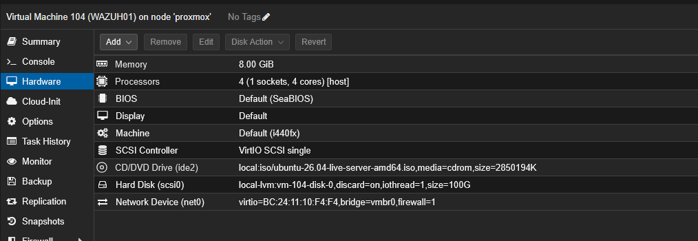
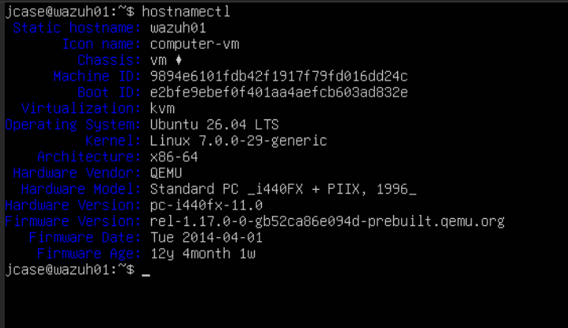
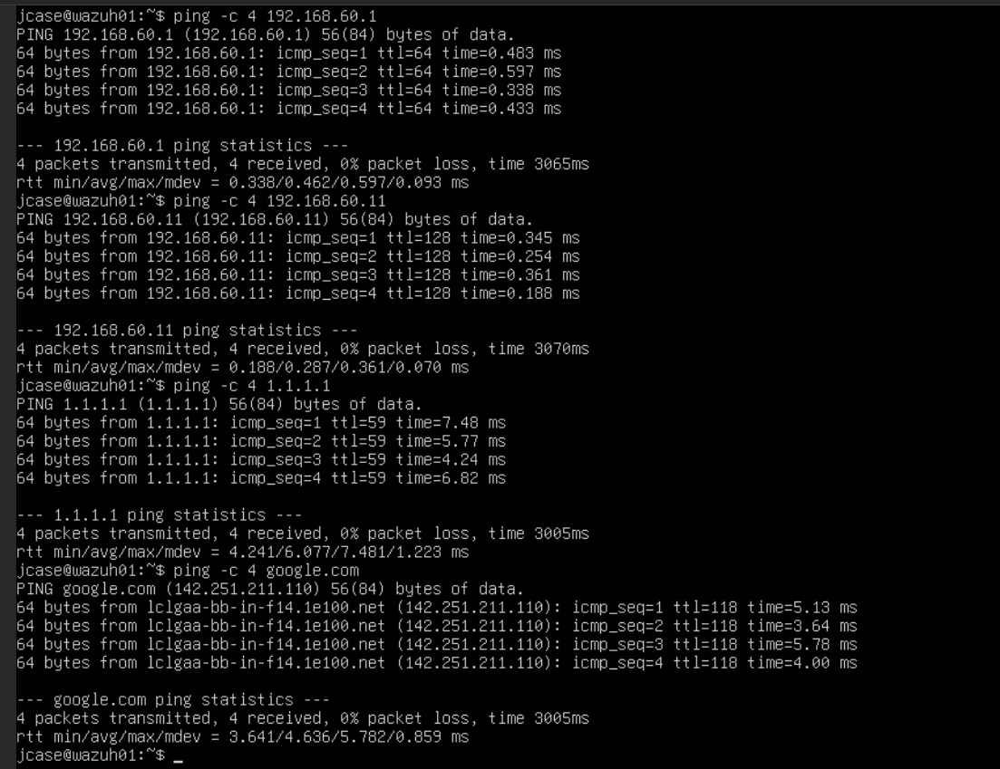
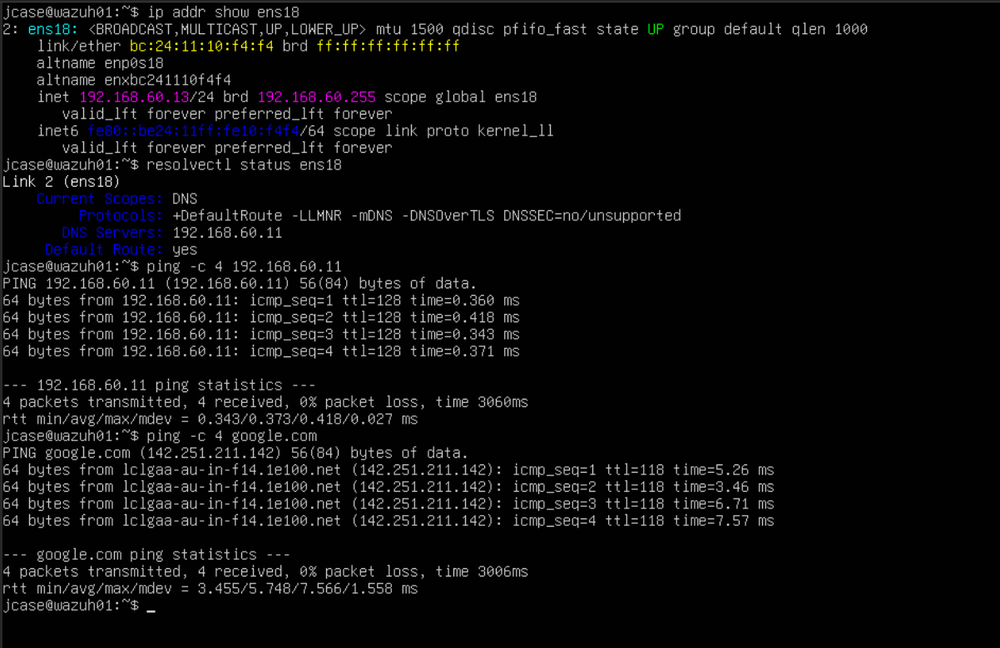
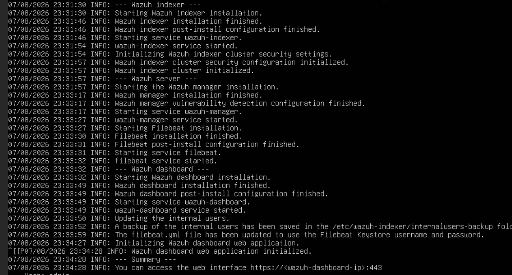
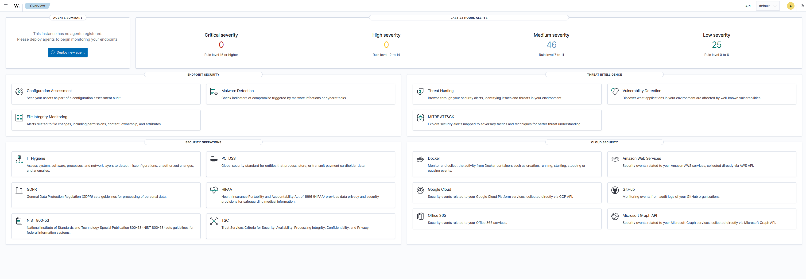
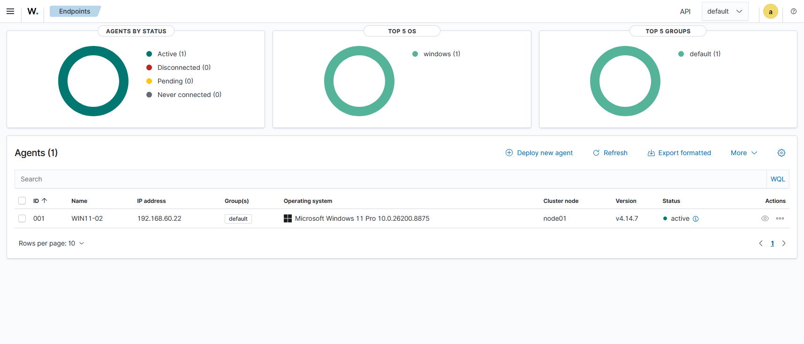
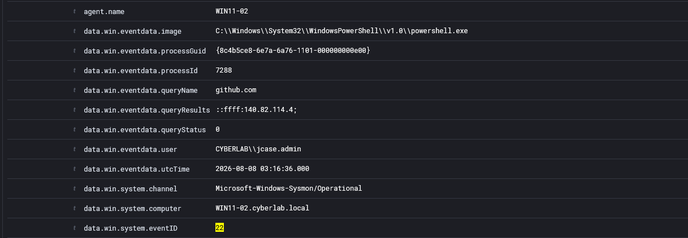
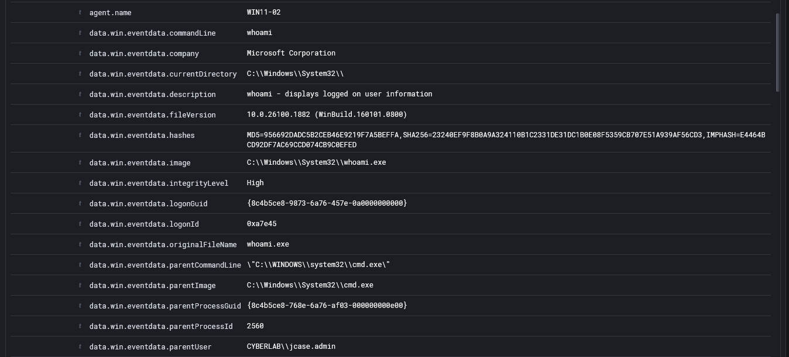

# Wazuh SIEM Deployment

This section documents the deployment of Wazuh as the centralized SIEM platform for the `cyberlab.local` Active Directory security lab.

The current phase establishes the Wazuh infrastructure, connects the first Windows endpoint, and validates centralized ingestion and searching of Sysmon telemetry.

> **Status:** In Progress

## Current Architecture

### WIN11-02

- Windows Event Logs
- Microsoft Sysmon
- Wazuh Agent
- Sends telemetry to `WAZUH01`

### WAZUH01

- Ubuntu Server
- Wazuh Manager
- Wazuh Indexer
- Wazuh Dashboard
- Centralized event storage and analysis

## Completed

- Deployed a dedicated Ubuntu Server VM for Wazuh
- Configured static networking for `WAZUH01`
- Installed the Wazuh Manager, Indexer, and Dashboard
- Verified access to the Wazuh web dashboard
- Deployed the Wazuh agent to `WIN11-02`
- Verified the endpoint successfully connected to the Wazuh manager
- Configured the Windows agent to collect the Sysmon Operational event channel
- Enabled Wazuh archive indexing for raw-event searches
- Verified centralized Sysmon DNS telemetry
- Verified centralized Sysmon process-creation telemetry

## Wazuh Server Deployment

Wazuh was deployed on a dedicated Ubuntu Server VM rather than directly on a domain-joined Windows system.

This keeps the monitoring infrastructure logically separate from the Active Directory environment it is monitoring.

### Virtual Machine Resources

### Ubuntu Server Installation

Ubuntu Server was installed and configured as the operating system for the dedicated Wazuh server.

### Network Connectivity

Initial network connectivity was validated to confirm that `WAZUH01` could communicate with the Cyber Lab network and reach required external resources.

### Static Network Configuration

`WAZUH01` was assigned a static IP address on the Cyber Lab network and configured to use the internal Active Directory DNS server.

## Wazuh Installation

The Wazuh Manager, Indexer, and Dashboard were installed together on `WAZUH01` as a single-node SIEM deployment.

This deployment provides the core components required to collect, store, search, and analyze endpoint security telemetry.

## Wazuh Dashboard

The Wazuh dashboard was successfully accessed after installation, confirming that the centralized monitoring platform was operational.

## Endpoint Onboarding

`WIN11-02` was selected as the first monitored Windows endpoint.

The Wazuh agent was installed and configured to communicate with `WAZUH01`.

The agent successfully connected and reported an **Active** status in the Wazuh dashboard.

This validated communication between the monitored endpoint and the centralized Wazuh infrastructure.

## Centralized Sysmon Telemetry

The Wazuh agent configuration on `WIN11-02` was extended to collect events from the Sysmon Operational event channel:

`Microsoft-Windows-Sysmon/Operational`

Wazuh archive indexing was also enabled so that raw endpoint telemetry could be searched even when an event did not trigger a predefined Wazuh alert.

### DNS Telemetry

A Sysmon Event ID `22` DNS query generated on `WIN11-02` was successfully forwarded to Wazuh and located through centralized event searches.

This demonstrated that DNS telemetry collected locally by Sysmon could be analyzed remotely from the SIEM.

### Process Creation Telemetry

A Sysmon Event ID `1` process-creation event was also successfully collected and searched through Wazuh.

Process telemetry includes useful investigation context such as executable paths, command lines, users, parent processes, and process identifiers.

## Telemetry Pipeline

The completed tests validated the following security-monitoring pipeline:

**Windows Activity → Sysmon → Wazuh Agent → Wazuh Manager → Wazuh Indexer → Wazuh Dashboard**

This allows endpoint activity generated on a Windows workstation to be collected locally, forwarded to the SIEM, stored centrally, and searched from a single interface.

## Current Result

The lab now has a functioning centralized security-monitoring pipeline.

Endpoint activity generated on `WIN11-02` can be collected by Sysmon, forwarded by the Wazuh agent, stored centrally, and investigated through the Wazuh dashboard.

This creates the foundation required for future:

- Threat hunting
- Alert investigation
- Attack simulation
- Detection engineering
- Multi-endpoint correlation

## Next Steps

- Deploy Sysmon to `WIN11-01`
- Deploy Sysmon to `FS01`
- Deploy Sysmon to `DC01`
- Install Wazuh agents on the remaining Windows systems
- Configure Sysmon event collection on each endpoint
- Verify centralized telemetry from all monitored systems
- Generate controlled suspicious activity
- Analyze alerts and raw telemetry
- Develop detection logic
- Perform attack simulations and document investigations

## Skills Demonstrated

- Wazuh SIEM deployment
- Linux server administration
- SIEM architecture
- Wazuh agent deployment
- Centralized Windows event collection
- Sysmon integration
- Raw event indexing
- Security telemetry analysis
- Endpoint monitoring
- SIEM troubleshooting
